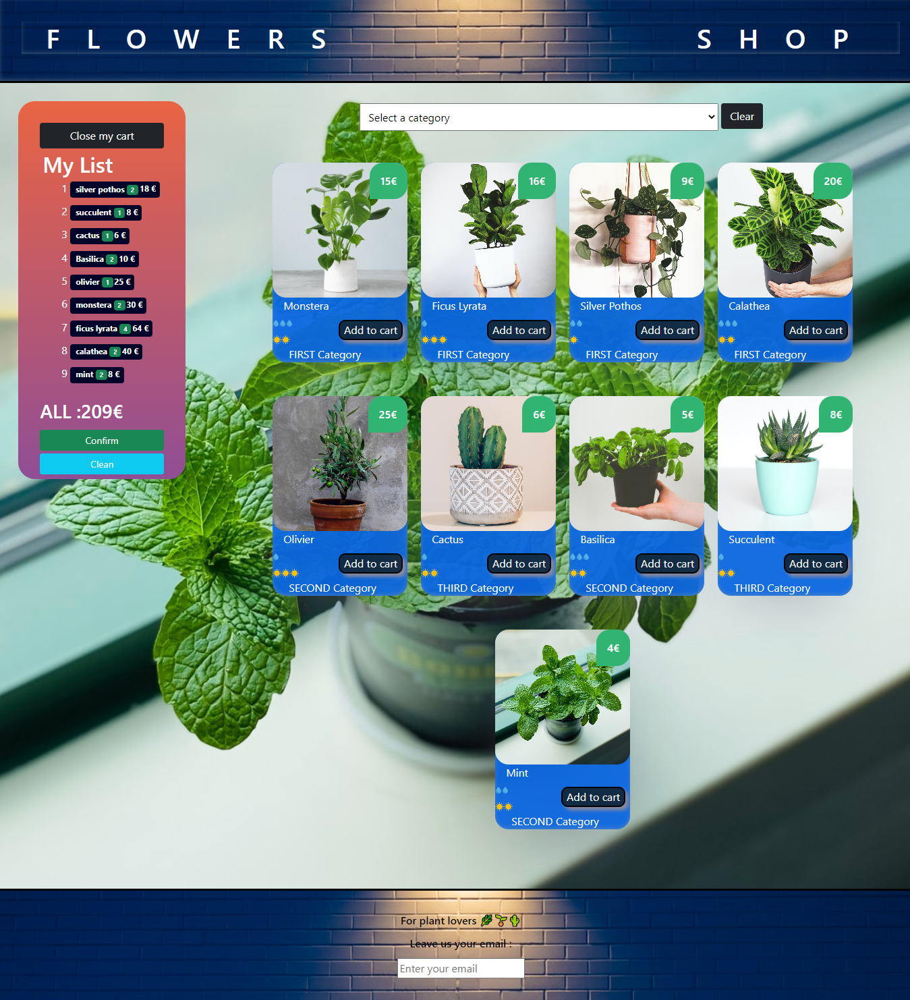

 # React Framework shop app
 

 


  # Table of contents
* [Description](#DESCRIPTION)
* [Technologies](#technologies)
* [Setup](#setup)


## This project is a WEB APP for shopping created with React Framewrok
 ### allowing users to:
  * see all flowers in the shop
  * add flowers to cart
  * open cart
  * close cart
  * see total price 
  * see the price od each flower
 
	
## Technologies
### This project is created with:
* React Framework

	
## Setup


To run this project 
* Available Scripts In the project directory, you can run:
``` npm start ```
